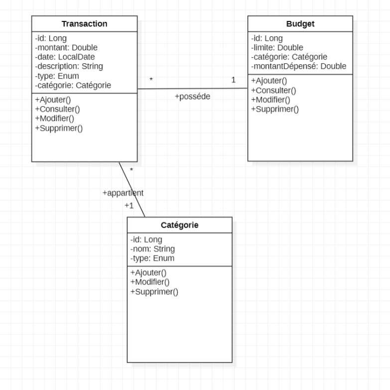
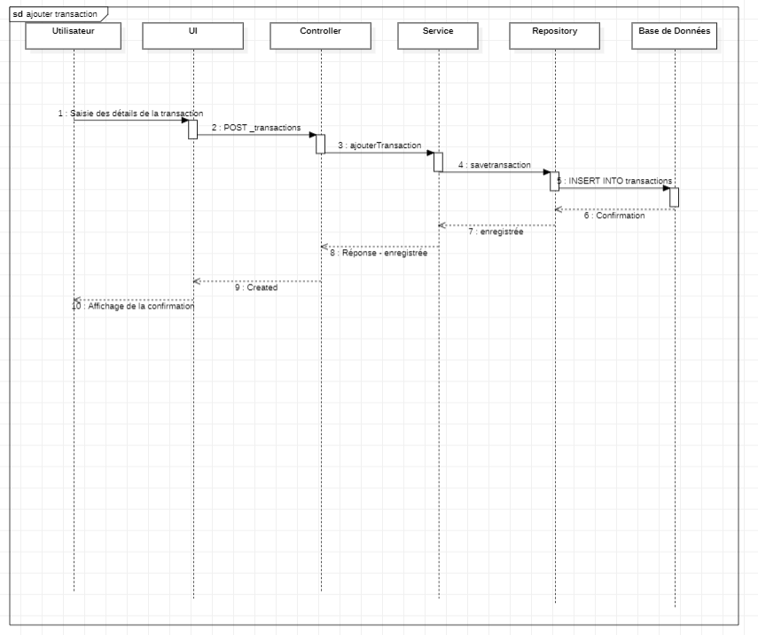
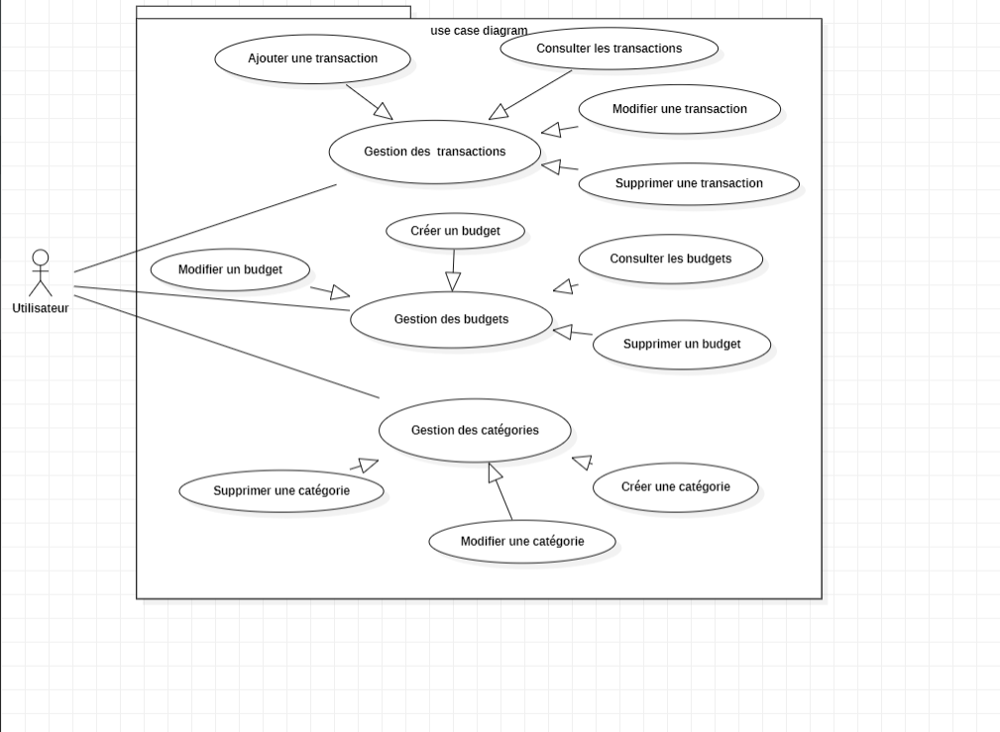

**Budget Manager**

Budget Manager is a full-stack web application designed to help users take control of their finances by efficiently tracking expenses and income. It offers an intuitive interface for managing daily financial activities such as transactions, budgets, and categories, providing a comprehensive overview of the user's financial status.

---

**🧩 Features**

🔹 Transaction Management
Add income or expense transactions with details like amount, category, date, and description.
View all transactions with filtering and sorting options (by date, amount, or category).
Edit or delete transactions easily.

🔹 Budget Management
Set budget limits for specific spending categories (e.g., food, housing, transport).
View budget status, limits, and actual spending per category.
Edit or delete existing budgets as needed.

🔹 Category Management
Create custom categories to better organize your income and expenses.
Modify or delete categories based on your preferences.

---

**🛠️ Tech Stack**

🔸 Backend
Spring Boot – RESTful API development
Spring Data JPA – Database persistence layer
Lombok – Reduces boilerplate code
MapStruct – DTO mapping
JUnit – Unit testing

🔸 Frontend
Angular 16+ – Frontend framework
RxJS – Reactive programming
Angular Forms – Supports template-driven and reactive forms
Tailwind CSS – UI styling and layout
HttpClient – Communicates with backend APIs
Angular Router – Client-side routing

 **UML-Diagrams**

 -class diagram

 -sequence diagram

 -use case diagram

